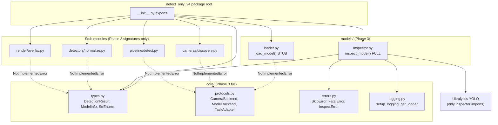

# Phase 3: Core API & Contracts - Research

**Researched:** 2026-07-03
**Domain:** Greenfield Python package contracts, Ultralytics model inspection, stdlib logging
**Confidence:** HIGH

## Summary

Phase 3 establishes the `src/detect_only_v4/` greenfield package with typed contracts (`DetectionResult`, `ModelInfo`, StrEnums), structured logging, and a fully implemented `inspect_model()` that resolves model family, task, format, and class names through an ordered identification chain — never guessing. All other public API functions are typed stubs raising `NotImplementedError` with docstrings pointing to their target phases.

The identification chain is the critical path: Ultralytics `YOLO(path)` lightweight init exposes authoritative `model.task`, `model.names`, `model.stride`, and `model.model.yaml["yaml_file"]` for `.pt` and most loadable formats [CITED: docs.ultralytics.com/modes/predict/]. For NCNN/OpenVINO export directories, `metadata.yaml` in the export folder is authoritative — Ultralytics writes `task`, `stride`, `imgsz`, `names`, `end2end` at export time [CITED: docs.ultralytics.com/modes/export/] [VERIFIED: ultralytics/engine/exporter.py via installed 8.4.60]. Filename heuristics are hints only; dry inference on a 640×640 zero frame inspects `Results` tensor keys as a last resort before returning `unknown` [CITED: PITFALLS.md Pitfall 2].

`pyproject.toml` already declares `ultralytics>=8.4.0` and discovers packages under `src/` via setuptools — adding `detect_only_v4/` requires no structural change beyond ensuring the directory exists. PyYAML (already in optional `control-drivehub` extra; add to core or `detect-only-v4` extra) parses `metadata.yaml`. CI tests must mock `YOLO` — no real weights required except an optional `@pytest.mark.integration` gate.

**Primary recommendation:** Implement `inspect_model()` as a pure path-in → `ModelInfo`-out function with explicit step logging, `ast.literal_eval` for string-encoded metadata fields (matching Ultralytics `BaseBackend.apply_metadata`), and `unittest.mock.patch("detect_only_v4.models.inspector.YOLO")` for all unit tests.

## Architectural Responsibility Map

| Capability | Primary Tier | Secondary Tier | Rationale |
|------------|-------------|----------------|-----------|
| Type contracts (`DetectionResult`, enums) | Library core (`core/types.py`) | — | Hub schema consumed by adapters, API, tests |
| Protocol ABCs | Library core (`core/protocols.py`) | — | Compile-time contracts for later phases |
| Error taxonomy | Library core (`core/errors.py`) | Logging (`core/logging.py`) | Skip vs fatal classification starts here |
| Structured logging | Library core (`core/logging.py`) | — | Stdlib only; no third-party log framework |
| `inspect_model()` | Model layer (`models/inspector.py`) | Ultralytics runtime (external) | Only Phase 3 module that imports Ultralytics |
| Public API surface | Package root (`__init__.py`) | Stub modules per domain | Single import path for downstream phases |
| Package wiring | Build config (`pyproject.toml`) | — | setuptools `packages.find` under `src/` |

<user_constraints>
## User Constraints (from CONTEXT.md)

### Locked Decisions

#### DetectionResult schema
- **D-01:** `DetectionResult` fields: `class_id`, `class_name`, `confidence`, `xyxy` (4 floats), `center_x`, `center_y`, `width`, `height`, `track_id=None`, optional `mask`, `keypoints`, `obb_points`, `angle`.
- **D-02:** `mask` = list of polygon rings as `list[list[list[float]]]` — each ring is `[[x,y], ...]` JSON-safe floats; no raw ndarray on wire.
- **D-03:** `keypoints` = `list[dict]` with keys `x`, `y`, `conf` (float).
- **D-04:** `obb_points` = 4 corner pairs `[[x,y], ...]`; `angle` = float degrees; both optional, populated only for OBB task.
- **D-05:** `track_id` always `None` in v2.0 — no tracker integration.

#### inspect_model identification chain
- **D-06:** Resolution order (stop at first confident result): (1) `YOLO(path).task` + checkpoint metadata after lightweight init for loadable paths; (2) `metadata.yaml` in NCNN/OpenVINO export directories; (3) filename heuristics as hints only (`yolo26*`, `yolo11*`, `yolov8*`, `-seg`, `-pose`, `-obb`); (4) single dry inference on dummy 640×640 zeros frame, inspect output tensor keys; (5) return `unknown` for family/task if still ambiguous — never guess.
- **D-07:** `inspect_model` returns `ModelInfo` dataclass: `path`, `format`, `family`, `task`, `class_names`, `imgsz`, `stride`, `loadable`, `error`, `identify_steps` (list of steps taken), `timing_ms` dict.
- **D-08:** `.engine` on Pi: `loadable=False`, `error` explains CUDA/TensorRT required — still inspectable for format discovery.

#### Phase 3 scope (full vs stub)
- **D-09:** **Full implementation:** `core/types.py`, `core/protocols.py`, `core/errors.py`, `core/logging.py`, `models/inspector.py`, package `__init__.py` exports, `pyproject.toml` package entry if missing.
- **D-10:** **Stub only (signature + NotImplementedError):** `load_model`, `detect_frame`, `discover_cameras`, `probe_camera`, `normalize_results`, `draw_overlay` — each in dedicated module with docstring referencing target phase.
- **D-11:** `inspect_model` is the only function that may import/invoke Ultralytics in Phase 3.

#### Enums and serialization
- **D-12:** `TaskKind` StrEnum: `detect`, `segment`, `pose`, `obb`, `unknown`.
- **D-13:** `ModelFamily` StrEnum: `yolov8`, `yolo11`, `yolo26`, `unknown`.
- **D-14:** `ModelFormat` StrEnum: `pt`, `onnx`, `engine`, `tflite`, `ncnn`, `openvino`, `unknown`.
- **D-15:** All dataclasses expose `to_dict()` → JSON-serializable plain strings for enums.

#### Logging
- **D-16:** stdlib logging; root logger name `detect_only_v4`.
- **D-17:** Levels: INFO for inspect start/complete and loadable verdict; DEBUG per identification step; WARNING when falling back to dry infer or filename hint; ERROR on inspect failure.
- **D-18:** `inspect_model` records `timing_ms`: `init`, `metadata`, `dry_infer`, `total`.

#### Greenfield constraint
- **D-19:** Zero imports from `hex_detector`, `block_detected`, `block_detected_v1`, `view`, `stream`, or any legacy module.

### Claude's Discretion
- Exact dummy frame size for dry infer (640 default aligned with YOLO).
- Whether `inspect_model` caches YOLO instance per path within call only (no global cache in Phase 3).
- Test fixture strategy for inspect without real weights in CI.

### Deferred Ideas (OUT OF SCOPE)
- `load_model` NCNN priority — Phase 4
- Task adapters — Phase 5
- Camera Picamera2 — Phase 6
- Full `detect_frame` — Phase 5/7
</user_constraints>

<phase_requirements>
## Phase Requirements

| ID | Description | Research Support |
|----|-------------|------------------|
| CORE-01 | Greenfield `src/detect_only_v4/` — no legacy imports | D-19; package layout below; `pyproject.toml` `packages.find where=["src"]` already configured |
| CORE-02 | `DetectionResult` dataclass with all specified fields | D-01–D-05; `to_dict()` pattern; per-detection record (not per-frame wrapper) |
| CORE-03 | Public API exports: 7 functions from package root | D-09/D-10; `__init__.py` re-export table; stubs in dedicated modules |
| CORE-04 | `inspect_model` returns family, task, format, class names — prefer `model.task` + metadata | D-06/D-07; identification chain pseudocode; Ultralytics API verified below |
| CORE-05 | Fallback filename → dry infer; `unknown` when insufficient — no guessing | D-06 step 3–5; dry-infer key priority; PITFALLS.md Pitfall 2 |
| CORE-06 | Structured logging + per-stage timings + error taxonomy | D-16–D-18; `core/logging.py` + `core/errors.py` design |
</phase_requirements>

## Standard Stack

### Core

| Library | Version | Purpose | Why Standard |
|---------|---------|---------|--------------|
| **Python** | ≥3.10 (repo); 3.11 Pi target | Runtime | `requires-python` in pyproject.toml |
| **ultralytics** | **8.4.86** latest PyPI; pin `>=8.4.0,<9.0` | `YOLO(path)`, `model.task`, dry `predict()` | Single API for all formats; export metadata convention [CITED: docs.ultralytics.com/modes/export/] |
| **PyYAML** | **6.0.3** | Parse `metadata.yaml` sidecars | Ultralytics uses `YAML.load/save`; string fields need `ast.literal_eval` [VERIFIED: ultralytics/nn/backends/base.py] |
| **stdlib `logging`** | built-in | Structured inspect logging | D-16; no structlog dependency |
| **stdlib `enum.StrEnum`** | 3.11+ (backport via `str, Enum` for 3.10) | `TaskKind`, `ModelFamily`, `ModelFormat` | D-12–D-14; JSON via `.value` in `to_dict()` |
| **stdlib `dataclasses`** | built-in | `DetectionResult`, `ModelInfo` | Project convention; `to_dict()` custom method |
| **numpy** | via ultralytics | Dummy 640×640 frame for dry infer | `np.zeros((640,640,3), dtype=np.uint8)` [VERIFIED: live probe] |

### Supporting

| Library | Version | Purpose | When to Use |
|---------|---------|---------|-------------|
| **pytest** | ≥8.0 (dev extra) | Unit tests | `tests/detect_only_v4/` per QA-03 |
| **unittest.mock** | stdlib | Mock `YOLO` in CI | All inspect tests without weights |

### Alternatives Considered

| Instead of | Could Use | Tradeoff |
|------------|-----------|----------|
| stdlib logging | structlog | Adds dependency; CONTEXT locks stdlib |
| Custom metadata parser | Reuse `ultralytics.utils.YAML` | Couples inspector to ultralytics internals; prefer PyYAML + `ast.literal_eval` mirroring `BaseBackend.apply_metadata` |
| Pydantic models | dataclasses | Pydantic deferred to API layer (Phase 8); core uses dataclasses per ARCHITECTURE.md |

**Installation (already in repo root deps):**
```bash
pip install "ultralytics>=8.4.0,<9.0" "pyyaml>=6.0"
```

**Version verification (2026-07-03):**
```text
pip index versions ultralytics  → 8.4.86 (latest)
pip index versions pyyaml       → 6.0.3 (latest)
pip show ultralytics            → 8.4.60 installed locally
```

## Package Legitimacy Audit

| Package | Registry | Age | Downloads | Source Repo | slopcheck | Disposition |
|---------|----------|-----|-----------|-------------|-----------|-------------|
| ultralytics | PyPI | ~4 yrs | very high | github.com/ultralytics/ultralytics | OK | Approved |
| pyyaml | PyPI | ~15 yrs | very high | github.com/yaml/pyyaml | OK | Approved |

**Packages removed due to slopcheck [SLOP] verdict:** none
**Packages flagged as suspicious [SUS]:** none

## Architecture Patterns

### System Architecture Diagram



### Recommended File List (Phase 3 deliverables)

```
src/detect_only_v4/
├── __init__.py                 # PUBLIC: re-export 7 API functions + key types
├── core/
│   ├── __init__.py
│   ├── types.py                # FULL: DetectionResult, ModelInfo, TaskKind, ModelFamily, ModelFormat
│   ├── protocols.py            # FULL: CameraBackend, ModelBackend, TaskAdapter ABCs
│   ├── errors.py               # FULL: error taxonomy (see below)
│   └── logging.py              # FULL: setup_logging(), get_logger("detect_only_v4")
├── models/
│   ├── __init__.py
│   ├── inspector.py            # FULL: inspect_model()
│   ├── loader.py               # STUB: load_model() → Phase 4
│   └── _path_utils.py          # OPTIONAL internal: resolve_format(path), find_metadata_yaml(path)
├── cameras/
│   ├── __init__.py
│   └── discovery.py            # STUB: discover_cameras(), probe_camera() → Phase 6
├── detectors/
│   ├── __init__.py
│   └── normalize.py            # STUB: normalize_results() → Phase 5
├── render/
│   ├── __init__.py
│   └── overlay.py              # STUB: draw_overlay() → Phase 5
└── pipeline/
    ├── __init__.py
    └── detect.py               # STUB: detect_frame() → Phase 5/7

tests/detect_only_v4/
├── conftest.py                 # mock_yolo fixture, tmp_metadata_dir fixture
├── test_types.py               # DetectionResult JSON round-trip, enum serialization
├── test_inspector.py           # identification chain with mocked YOLO
├── test_inspector_metadata.py  # metadata.yaml parsing (no YOLO)
├── test_stubs.py               # each stub raises NotImplementedError
├── test_logging.py             # logger name, level helpers
└── fixtures/
    ├── metadata_detect.yaml
    ├── metadata_segment.yaml
    ├── metadata_pose.yaml
    └── ncnn_dir/               # metadata.yaml only (no .param/.bin needed for step 2)
        └── metadata.yaml

pyproject.toml                  # verify setuptools finds detect_only_v4 under src/
```

**`pyproject.toml` changes (minimal):**
- No change required for package discovery — `[tool.setuptools.packages.find] where = ["src"]` already includes new package.
- Add `pyyaml>=6.0` to main `dependencies` OR document it ships via existing deps (ultralytics already depends on PyYAML).
- Optional: add `[project.optional-dependencies] detect-only-v4 = [...]` stub for Phase 9 (QA-05); not blocking Phase 3.

### Pattern 1: StrEnum + dataclass `to_dict()`

**What:** StrEnums serialize as `.value` strings; dataclasses implement explicit `to_dict()` (not `dataclasses.asdict` alone — avoids Enum objects in output).

**When:** Every wire-format type in `core/types.py`.

**Example:**
```python
# Pattern aligned with D-12–D-15
from dataclasses import dataclass, field
from enum import StrEnum
from typing import Any

class TaskKind(StrEnum):
    DETECT = "detect"
    SEGMENT = "segment"
    POSE = "pose"
    OBB = "obb"
    UNKNOWN = "unknown"

@dataclass
class DetectionResult:
    class_id: int
    class_name: str
    confidence: float
    xyxy: tuple[float, float, float, float]
    center_x: float
    center_y: float
    width: float
    height: float
    track_id: int | None = None
    mask: list[list[list[float]]] | None = None
    keypoints: list[dict[str, float]] | None = None
    obb_points: list[list[float]] | None = None
    angle: float | None = None

    def to_dict(self) -> dict[str, Any]:
        return {
            "class_id": self.class_id,
            "class_name": self.class_name,
            "confidence": self.confidence,
            "xyxy": list(self.xyxy),
            "center_x": self.center_x,
            "center_y": self.center_y,
            "width": self.width,
            "height": self.height,
            "track_id": self.track_id,
            "mask": self.mask,
            "keypoints": self.keypoints,
            "obb_points": self.obb_points,
            "angle": self.angle,
        }
```

### Pattern 2: Lazy Ultralytics import inside `inspector.py` only

**What:** `from ultralytics import YOLO` appears only in `models/inspector.py` (D-11). All other modules remain importable without torch/ultralytics loaded.

**When:** Any future module must not accidentally pull ultralytics at import time.

### Pattern 3: Error taxonomy (skip vs fatal)

**What:** Typed exceptions in `core/errors.py` establish CORE-06 foundation for pipeline phases.

| Exception | Base | Semantics | Phase 3 usage |
|-----------|------|-----------|---------------|
| `DetectOnlyError` | `Exception` | Root | All package errors |
| `InspectError` | `DetectOnlyError` | Inspect failed; returns `ModelInfo.error` | `inspect_model` catch-all |
| `ModelFormatError` | `InspectError` | Unrecognized path/format | Bad extension |
| `PlatformUnsupportedError` | `InspectError` | `.engine` without CUDA | D-08 |
| `SkipFrameError` | `DetectOnlyError` | Recoverable; log + continue | Stub only; used Phase 7 |
| `FatalPipelineError` | `DetectOnlyError` | Stop session | Stub only; used Phase 7 |

### Pattern 4: Structured logging setup

**What:** `setup_logging(level=logging.INFO)` configures root logger `detect_only_v4` with a single `StreamHandler` and consistent format including `%(name)s`.

```python
# core/logging.py pattern
import logging

LOGGER_NAME = "detect_only_v4"

def setup_logging(level: int = logging.INFO) -> None:
    logger = logging.getLogger(LOGGER_NAME)
    if not logger.handlers:
        handler = logging.StreamHandler()
        handler.setFormatter(logging.Formatter(
            "%(asctime)s %(levelname)s [%(name)s] %(message)s"
        ))
        logger.addHandler(handler)
    logger.setLevel(level)

def get_logger(name: str | None = None) -> logging.Logger:
    return logging.getLogger(f"{LOGGER_NAME}.{name}" if name else LOGGER_NAME)
```

### inspect_model Algorithm (pseudocode)

```text
function inspect_model(path: str | Path) -> ModelInfo:
    t0 = now()
    steps = []
    timing = {init: 0, metadata: 0, dry_infer: 0, total: 0}
    logger.info("inspect_model start", path=path)

    resolved = Path(path).resolve()
    fmt = detect_format(resolved)          # extension or *_ncnn_model/ / *_openvino_model/ dir
    steps.append(f"format:{fmt}")

  # --- Early gate: .engine on non-CUDA ---
    if fmt == ENGINE and not cuda_available():
        return ModelInfo(
            path=str(resolved), format=ENGINE, family=UNKNOWN, task=UNKNOWN,
            class_names={}, imgsz=None, stride=None,
            loadable=False,
            error="TensorRT .engine requires CUDA/NVIDIA GPU; not supported on this platform",
            identify_steps=steps, timing_ms={..., total: elapsed(t0)}
        )

  # --- Step 1: YOLO lightweight init (loadable paths only) ---
    if fmt in {PT, ONNX, TFLITE, NCNN, OPENVINO} and path_exists(resolved):
        t1 = now()
        try:
            model = YOLO(str(resolved), verbose=False)   # single instance for this call only
            task = map_task(model.task)                  # "classify" → UNKNOWN (out of scope)
            family = infer_family(model)                 # yaml_file stem + metadata description
            names = normalize_names(model.names)         # dict[int,str]
            imgsz = extract_imgsz(model)                 # overrides/args/metadata
            stride = int(max(model.stride)) if hasattr(model, "stride") else None
            timing.init = elapsed(t1)
            steps.append(f"yolo_init:task={task},family={family}")

            if task != UNKNOWN and family != UNKNOWN:
                return success_model_info(...)

            # partial: keep model ref for step 4 if task or family still unknown
        except Exception as e:
            logger.error("yolo init failed", exc_info=e)
            steps.append(f"yolo_init_failed:{e}")
            model = None
            # continue to metadata / heuristics / dry infer

  # --- Step 2: metadata.yaml (export directories) ---
    t2 = now()
    meta_path = find_metadata_yaml(resolved)   # dir/metadata.yaml or parent for .onnx
    if meta_path:
        meta = parse_metadata_yaml(meta_path)    # PyYAML + ast.literal_eval string fields
        timing.metadata = elapsed(t2)
        steps.append(f"metadata_yaml:{meta_path.name}")
        task = coalesce(task, map_task(meta.get("task")))
        family = coalesce(family, infer_family_from_meta(meta, resolved))
        names = coalesce(names, normalize_names(meta.get("names")))
        imgsz = coalesce(imgsz, normalize_imgsz(meta.get("imgsz")))
        stride = coalesce(stride, meta.get("stride"))

        if task != UNKNOWN:                        # confident from metadata
            return success_model_info(...)

  # --- Step 3: filename heuristics (hints only — never sole source for task) ---
    hint_task, hint_family = filename_hints(resolved.stem)   # -seg, -pose, -obb; yolo26/yolo11/yolov8
    if hint_family != UNKNOWN and family == UNKNOWN:
        family = hint_family
        steps.append(f"filename_hint:family={family}")
        logger.warning("family from filename hint only")
    # task from filename alone does NOT return early — must confirm via step 1 or 4

  # --- Step 4: dry inference (last resort before unknown) ---
    if model is not None and task == UNKNOWN:
        t3 = now()
        logger.warning("falling back to dry inference for task detection")
        frame = np.zeros((640, 640, 3), dtype=np.uint8)
        result = model.predict(frame, verbose=False)[0]
        task = infer_task_from_results(result)   # priority: obb > keypoints > masks > boxes → detect
        timing.dry_infer = elapsed(t3)
        steps.append(f"dry_infer:task={task}")
        # if still UNKNOWN after dry infer → leave as UNKNOWN (never guess)

  # --- Step 5: finalize ---
    timing.total = elapsed(t0)
    loadable = fmt != ENGINE or cuda_available()
    logger.info("inspect_model complete", task=task, family=family, loadable=loadable)
    return ModelInfo(...)

function infer_task_from_results(result) -> TaskKind:
    if result.obb is not None: return OBB
    if result.keypoints is not None: return POSE
    if result.masks is not None: return SEGMENT
    if result.boxes is not None: return DETECT
    return UNKNOWN

function infer_family(model) -> ModelFamily:
    yaml_file = model.model.yaml.get("yaml_file", "")   # e.g. "yolo26n.yaml"
    return map_yaml_stem_to_family(yaml_file)           # yolo26→yolo26, yolo11→yolo11, yolov8→yolov8

function parse_metadata_yaml(path) -> dict:
    raw = yaml.safe_load(path.read_text())
    for k in ("stride", "batch", "channels", "imgsz", "names", "end2end", "args"):
        if k in raw and isinstance(raw[k], str):
            raw[k] = ast.literal_eval(raw[k])   # match Ultralytics BaseBackend.apply_metadata
    return raw
```

### Anti-Patterns to Avoid

- **Guessing task from filename alone:** `-seg` in `best.pt` is not authoritative (PITFALLS.md #2). Filename may set `family` hint only.
- **Importing Ultralytics outside `inspector.py`:** Violates D-11; slows stub-only imports.
- **Global YOLO cache in Phase 3:** Defer to Phase 4 loader; per-call instance is safer.
- **`dataclasses.asdict` for wire format:** Leaves Enum instances; use explicit `to_dict()`.
- **Reading legacy code:** D-19 forbids imports from `hex_detector`, `block_detected*`, etc.

## Don't Hand-Roll

| Problem | Don't Build | Use Instead | Why |
|---------|-------------|-------------|-----|
| YAML metadata parsing with string dicts | Custom regex parser | PyYAML + `ast.literal_eval` for string fields | Ultralytics exports `names: "{0: 'person'}"` as strings [VERIFIED: GitHub PR #15883] |
| Model task detection | Filename rules only | `model.task` then `metadata.yaml` then dry infer | Authoritative order in D-06 |
| JSON serialization | Manual field copy per consumer | `DetectionResult.to_dict()` + `json.dumps` | Single wire contract |
| Logging framework | structlog/loguru | stdlib `logging` | D-16 |
| ONNX/NCNN graph parsing | Custom protobuf reader in Phase 3 | `YOLO(path)` init + `metadata.yaml` | Phase 4 backends own format specifics |

**Key insight:** `inspect_model` is a metadata reader, not a full loader. Lightweight `YOLO(path)` init is sufficient for `.pt`; export directories often fail init without runtime deps — `metadata.yaml` step 2 handles those without NCNN/OpenVINO installed in CI.

## Common Pitfalls

### Pitfall 1: Task guessing from filename (PITFALLS #2)

**What goes wrong:** `best-seg.pt` heuristic loads wrong adapter for a misnamed detect checkpoint.

**Why it happens:** Easy string matching; custom training names lack task signal.

**How to avoid:** Filename hints adjust `family` only; `task` requires step 1, 2, or 4 confirmation; else `unknown`.

**Warning signs:** `identify_steps` lacks `yolo_init` or `dry_infer` but task is set.

### Pitfall 2: metadata.yaml string-encoded fields

**What goes wrong:** `names` parsed as raw string `"{0: 'person'}"` breaks class name lookup.

**Why it happens:** Ultralytics serializes some metadata values as strings for YAML compatibility.

**How to avoid:** Mirror `BaseBackend.apply_metadata` — `ast.literal_eval` on `imgsz`, `names`, `stride` when `isinstance(v, str)`.

**Warning signs:** `class_names` is a string or empty after metadata parse.

### Pitfall 3: Dry infer task ambiguity on empty frame

**What goes wrong:** Zero frame yields no detections but `result.boxes` is still a `Boxes` object (truthy), not `None`.

**Why it happens:** Ultralytics always attaches task-appropriate result attributes [CITED: docs.ultralytics.com/modes/predict/ Results by Task].

**How to avoid:** Check attribute **presence** (`is not None`), not detection count. Priority: `obb` > `keypoints` > `masks` > `boxes` → detect.

**Warning signs:** Detect task returned for a pose model because `boxes` exists.

### Pitfall 4: `.engine` crash on Pi instead of graceful inspect

**What goes wrong:** TensorRT load throws opaque error during inspect on ARM.

**How to avoid:** D-08 early gate — `loadable=False`, clear error message, still return `format=engine`.

### Pitfall 5: Ultralytics import at package root

**What goes wrong:** `import detect_only_v4` pulls torch (slow, fails in minimal CI).

**How to avoid:** Ultralytics import only inside `inspect_model()` body or `inspector.py` module — stubs import without torch.

### Pitfall 6: `classify` / `semantic` tasks in scope

**What goes wrong:** Ultralytics returns `task="classify"` or semantic segmentation — outside v2.0 scope.

**How to avoid:** Map to `TaskKind.UNKNOWN`; document in `ModelInfo.error` or `identify_steps`.

## Code Examples

### Ultralytics YOLO init — authoritative fields [VERIFIED: live probe 8.4.60]

```python
from ultralytics import YOLO

model = YOLO("yolo26n.pt", verbose=False)
assert model.task == "detect"                          # str: detect|segment|pose|obb|classify|...
assert isinstance(model.names, dict)                   # {0: "person", ...}
assert int(max(model.stride)) == 32                    # tensor → int for ModelInfo.stride
yaml_file = model.model.yaml.get("yaml_file", "")      # "yolo26n.yaml" → family yolo26
imgsz = model.overrides.get("imgsz", 640)              # or model.model.args["imgsz"]
```

### Dry inference — Results attributes per task [CITED: docs.ultralytics.com/modes/predict/]

```python
import numpy as np

zeros = np.zeros((640, 640, 3), dtype=np.uint8)
result = model.predict(zeros, verbose=False)[0]

# Task-specific (only one primary set populated per task):
boxes = result.boxes       # detect, segment, pose
masks = result.masks       # segment only
keypoints = result.keypoints  # pose only
obb = result.obb           # obb only
```

### metadata.yaml parse (NCNN/OpenVINO export dirs) [CITED: docs.ultralytics.com/modes/export/]

```python
import ast
from pathlib import Path
import yaml

def load_export_metadata(meta_path: Path) -> dict:
    raw = yaml.safe_load(meta_path.read_text()) or {}
    for key in ("stride", "imgsz", "names", "end2end", "args", "batch"):
        if key in raw and isinstance(raw[key], str):
            raw[key] = ast.literal_eval(raw[key])
    return raw
# Expected keys: task, stride, imgsz, names, version, end2end
```

### Mock YOLO for CI tests

```python
from unittest.mock import MagicMock, patch
import pytest

@pytest.fixture
def mock_yolo_detect():
    mock_model = MagicMock()
    mock_model.task = "detect"
    mock_model.names = {0: "person"}
    mock_model.stride = [8, 16, 32]
    mock_model.model.yaml = {"yaml_file": "yolo26n.yaml"}
    mock_model.overrides = {"imgsz": 640}
    mock_result = MagicMock(boxes=MagicMock(), masks=None, keypoints=None, obb=None)
    mock_model.predict.return_value = [mock_result]
    with patch("detect_only_v4.models.inspector.YOLO", return_value=mock_model):
        yield mock_model
```

## Test Strategy (no real weights in CI)

| Test file | What it covers | Weights needed? |
|-----------|----------------|-----------------|
| `test_types.py` | `DetectionResult.to_dict()` JSON round-trip; enum values; optional fields `None` | No |
| `test_inspector_metadata.py` | Parse fixture `metadata.yaml` files; `ast.literal_eval` for string `names` | No |
| `test_inspector.py` | Full identification chain with `patch("...inspector.YOLO")`; step order; `unknown` when mock returns ambiguous data | No |
| `test_inspector.py` | `.engine` path → `loadable=False` on non-CUDA (mock `cuda_available`) | No |
| `test_stubs.py` | Each public stub raises `NotImplementedError` | No |
| `test_logging.py` | Logger name `detect_only_v4`; level mapping | No |
| `test_no_legacy_imports.py` | AST scan: no imports from `hex_detector`, `block_detected`, etc. | No |

**Optional integration (not CI default):**
```python
@pytest.mark.integration
def test_inspect_real_yolo26n(tmp_path):
    """Requires network once to cache yolo26n.pt; skip in CI with -m 'not integration'."""
    info = inspect_model("yolo26n.pt")
    assert info.task == TaskKind.DETECT
    assert info.family == ModelFamily.YOLO26
```

**Quick run:** `pytest tests/detect_only_v4/ -x -q`
**Exclude integration:** `pytest tests/detect_only_v4/ -m "not integration"`

## Risks and Mitigations

| Risk | Likelihood | Impact | Mitigation |
|------|------------|--------|------------|
| `YOLO(path)` init fails in CI without torch wheels | Medium | Tests fail | Mock YOLO for all default tests; mark real-weight tests `integration` |
| NCNN dir inspect without `ncnn` package installed | High | Step 1 fails, step 2 metadata must succeed | Always implement step 2 before dry infer; fixture tests for metadata-only dirs |
| `model.task` returns `classify` (out of scope) | Low | Wrong adapter later | Map to `TaskKind.UNKNOWN`; log WARNING |
| Filename hint mis-sets family | Medium | Wrong UI label, not wrong adapter if task from metadata | Never use filename for task alone; log WARNING on hint use |
| Dry infer slow in inspect path | Low | Inspect latency | Only run when steps 1–2 fail task; record `timing_ms.dry_infer`; single 640×640 frame |
| String-encoded `names` in metadata | High | Empty class names | `ast.literal_eval` per Ultralytics backend pattern |
| Importing ultralytics at package import | Medium | Slow/failed imports | Lazy import in `inspector.py` only |
| pyproject not finding package | Low | `import detect_only_v4` fails | Package under `src/detect_only_v4/`; existing `where=["src"]` config |

## State of the Art

| Old Approach | Current Approach | When Changed | Impact |
|--------------|------------------|--------------|--------|
| TFLite export flag `format=tflite` | `format=litert` (still `.tflite` file) | Ultralytics ≥8.4.83 | `ModelFormat.TFLITE` still correct for extension |
| Guess task from filename | Ordered chain ending in `unknown` | v2.0 D-06 | Prevents adapter mismatch |
| Monolithic detector types | Per-detection `DetectionResult` | v2.0 D-01 | JSON list per frame in later phases |

**Deprecated/outdated:**
- Importing from `hex_detector` / `block_detected*` — forbidden per D-19
- `half=True` / `int8=True` export flags — replaced by `quantize=` in Ultralytics 8.4+ [CITED: docs.ultralytics.com/modes/export/]

## Assumptions Log

| # | Claim | Section | Risk if Wrong |
|---|-------|---------|---------------|
| A1 | `model.model.yaml["yaml_file"]` stem reliably indicates family for official weights | inspect_model pseudocode | Custom checkpoints may lack yaml_file → family stays `unknown` (acceptable) |
| A2 | Dry infer on zeros still instantiates correct Results attribute set per task | Pitfall 3 | May need one non-zero pixel for edge backends — validate in Phase 4 |
| A3 | `pyyaml` does not need explicit pyproject entry (transitive via ultralytics) | Standard Stack | If ultralytics drops PyYAML dep, add explicit pin |

**If A1–A3 wrong:** Family/task may be `unknown` more often — preferred over wrong guess per D-06.

## Open Questions

1. **Should `CameraInfo` / `InferConfig` appear in Phase 3 types?**
   - What we know: ROADMAP mentions `CameraInfo`, `InferConfig` in deliverables line.
   - What's unclear: CONTEXT D-09 lists only `DetectionResult` + `ModelInfo` as full implementation.
   - Recommendation: Add minimal `CameraInfo` dataclass stub in `types.py` (fields only, no logic) if planner wants ROADMAP alignment; otherwise defer to Phase 6.

2. **`__main__.py` in Phase 3?**
   - Recommendation: Defer to Phase 9 (QA-05); not in D-09 list.

## Environment Availability

| Dependency | Required By | Available | Version | Fallback |
|------------|------------|-----------|---------|----------|
| Python | All | ✓ | 3.13.11 (dev); 3.11 Pi target | — |
| ultralytics | `inspect_model` | ✓ | 8.4.60 installed; 8.4.86 PyPI latest | Mock in tests |
| PyYAML | metadata parse | ✓ | 6.0.3 | — |
| pytest | Unit tests | ✓ | ≥8.0 in dev extra | — |
| torch | YOLO init | ✓ | 2.12.1+cu130 (dev) | Mock in CI |
| NCNN runtime | NCNN dir step 1 init | ✗ (dev Windows) | — | Step 2 metadata.yaml |
| CUDA / TensorRT | `.engine` load | ✓ (dev GPU) / ✗ (Pi) | — | D-08 early gate |

**Missing dependencies with no fallback:**
- None for Phase 3 CI (mock YOLO)

**Missing dependencies with fallback:**
- NCNN/OpenVINO runtime — use `metadata.yaml` path (step 2)

## Project Constraints (from .cursor/rules/ and AGENTS.md)

| Directive | Impact on Phase 3 |
|-----------|-------------------|
| Greenfield `detect_only_v4/` — no legacy imports | D-19 enforced; AST test recommended |
| Do not edit `models/*.pt` | Tests use mocks/fixtures, not repo `models/` |
| After code changes, run graphify rebuild | Run after implementation, not research |
| AGENTS.md layout describes v1 (`block_detected/`) | Informational only; v2.0 module is separate |

## Security Domain

### Applicable ASVS Categories

| ASVS Category | Applies | Standard Control |
|---------------|---------|------------------|
| V2 Authentication | no | N/A — LAN lab tool |
| V3 Session Management | no | N/A |
| V4 Access Control | no | N/A |
| V5 Input Validation | yes | Validate `path` exists; reject path traversal in `inspect_model` (resolve to absolute, optional repo-root check in Phase 4) |
| V6 Cryptography | no | N/A |

### Known Threat Patterns

| Pattern | STRIDE | Standard Mitigation |
|---------|--------|---------------------|
| Arbitrary file read via `inspect_model(path)` | Information disclosure | Resolve path; document that inspect reads user-supplied model paths only |
| Malicious YAML in `metadata.yaml` | Tampering | `yaml.safe_load` only; never `yaml.load` |

## Sources

### Primary (HIGH confidence)
- [Ultralytics Predict mode](https://docs.ultralytics.com/modes/predict/) — Results attributes per task (detect/segment/pose/obb)
- [Ultralytics Export mode](https://docs.ultralytics.com/modes/export/) — metadata.yaml on NCNN/OpenVINO dirs; format table
- Live probe: `YOLO("yolo26n.pt")` → `task=detect`, `yaml_file=yolo26n.yaml`, dry infer `boxes` truthy, `masks/keypoints/obb` None (ultralytics 8.4.60)
- Installed source: `ultralytics/nn/backends/base.py` — `apply_metadata` + `ast.literal_eval`
- Installed source: `ultralytics/engine/exporter.py` — metadata dict keys (`task`, `stride`, `imgsz`, `names`, `end2end`)

### Secondary (MEDIUM confidence)
- `.planning/research/PITFALLS.md` — Pitfall 2 (no task guessing)
- `.planning/research/ARCHITECTURE.md` — folder layout, dependency rule
- `.planning/phases/03-core-api-contracts/03-CONTEXT.md` — locked decisions D-01–D-19
- GitHub ultralytics PR #15883 — metadata.yaml string-encoded `names`

### Tertiary (LOW confidence)
- Family inference from `yaml_file` stem on custom checkpoints — validate with integration tests

## Metadata

**Confidence breakdown:**
- Standard stack: HIGH — verified PyPI versions + live YOLO probe
- Architecture: HIGH — locked CONTEXT + ARCHITECTURE.md alignment
- Pitfalls: HIGH — PITFALLS.md + verified Results attribute behavior

**Research date:** 2026-07-03
**Valid until:** 2026-08-03 (ultralytics 8.4.x stable); re-check if upgrading to 9.x
