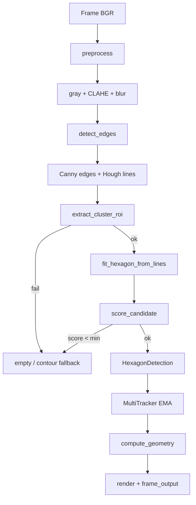

# block_detection_v2 — Logic & Pipeline

Tài liệu mô tả chi tiết module classical CV trong `src/block_detection_v2/`. Module này **tách biệt** với v1 (`block_detected`); không import code v1.

## Mục tiêu

Nhận diện **cụm block LEGO isometric** (chế độ 3-block), suy ra **6 đỉnh hexagon A–F**, hai mặt hình thang (front / right), đường chia block, tâm, yaw — chạy qua OpenCV viewer hoặc benchmark trên `block_dataset/` (108 ảnh `dt1.jpg`–`dt108.jpg`).

## Kiến trúc module

```
src/block_detection_v2/
├── main.py           # vòng lặp viewer + process_frame
├── pipeline.py       # detect_raw_hexagons — orchestration chính
├── preprocessing.py  # CLAHE, blur
├── edges.py          # Canny + Hough/LSD
├── roi.py            # cluster ROI + 3-block trim
├── hex_formula.py    # công thức hình thang chuẩn A–F
├── fit.py            # fit hex từ formula + tune offset
├── score.py          # topology + composite score
├── geometry.py       # front/right face, homography, block lines
├── tracker.py        # EMA + multi-block association
├── renderer.py       # overlay + JSON output
├── polygon.py        # contour fallback (legacy)
├── benchmark.py      # regression dt1–dt108
├── image_source.py   # đọc block_dataset, phím mũi tên
├── config.py         # hằng số pipeline
├── models.py         # Point2D, HexagonDetection, BlockResult
└── yolo_detector.py  # (Phase 18) YOLO first-pass — models/rbs-final.pt
```

## Luồng xử lý end-to-end



### Phase 18 (kế hoạch): YOLO trước, CV sau

```
Frame → YOLO (rbs-final.pt) → bbox block(s)
      → crop / mask ROI từ bbox
      → classical pipeline (edges → fit → score) trên vùng đó
```

Hiện tại `main.py` vẫn xử lý **full frame**. `yolo_detector.py` là lớp first-pass độc lập; wiring vào `pipeline.py` là scope Phase 18.

---

## 1. Preprocessing (`preprocessing.py`)

| Bước | Tham số config | Mô tả |
|------|----------------|-------|
| Resize tùy chọn | `RESIZE_WIDTH=0` (tắt) | Giữ nguyên kích thước frame |
| Gray | — | `BGR → GRAY` |
| CLAHE | `CLAHE_CLIP=2.0`, `CLAHE_TILE=(8,8)` | Cân bằng histogram cục bộ |
| Blur | `GAUSSIAN_KERNEL=(5,5)` | Giảm nhiễu trước Canny |

**Output:** `(color_frame, gray_blurred)` — color dùng render, gray dùng edge detection.

---

## 2. Edge detection (`edges.py`)

1. **Canny** trên gray: `CANNY_LOW=40`, `CANNY_HIGH=140`, `CANNY_APERTURE=3`
2. **Morph close** 3×3 — nối đứt đoạn cạnh
3. **HoughLinesP** (mặc định) hoặc **LSD** nếu `USE_LSD=True`:
   - `HOUGH_THRESHOLD=50`, `HOUGH_MIN_LINE_LEN=30`, `HOUGH_MAX_LINE_GAP=16`

**Output:** `(edges: uint8 mask, lines: List[((x1,y1),(x2,y2))])`

---

## 3. Cluster ROI (`roi.py`)

Tách **silhouette cụm block** khỏi pallet/nền; chế độ **3-block** cắt ~22% cạnh phải (bỏ block ngoài cùng bên phải).

### Thuật toán

1. **Mask pallet:** zero hàng dưới `ROI_PALLET_FRAC * height` (0.78) — loại sàn pallet
2. **Morph close + dilate** 9×9 — gộp edge thành blob
3. **Connected components:** chọn component tốt nhất theo score:
   ```
   score = area * (0.5 + 0.3*centrality + 0.2*upper_bonus)
   ```
   - `centrality`: gần giữa frame theo trục X
   - `upper_bonus`: ưu tiên vùng trên (block không nằm quá thấp, `cy > 0.88*h` bị loại)
   - `area < 800` bị loại
4. **Padding** ~4% bbox, clamp trong frame
5. **3-block trim:** `x1 -= full_w * ROI_RIGHT_TRIM_FRAC` (0.22), không thu hẹp quá 45% chiều rộng
6. **Bitmask** `ROIBox.mask` = giao rectangle × component mask, dilate 5×5

### `ROIBox`

| Field | Ý nghĩa |
|-------|---------|
| `x,y,w,h` | bbox integer |
| `mask` | uint8 H×W, 255 trong ROI |
| `area` | diện tích component gốc |
| `block_mode` | `3` = cụm 3 block |

---

## 4. Hexagon fit — hình thang chuẩn (`hex_formula.py` + `fit.py`)

### Topology đỉnh A–F

```
        A -------- B -------- C     ← hàng trên (L_top)
         \         |         /
          \        |        /
           F ------- E ------ D     ← hàng dưới (L_bot)
```

| Đỉnh | Vai trò |
|------|---------|
| A, B, C | Hàng trên trái → giữa → phải |
| F, E, D | Hàng dưới trái → giữa → phải |
| A-B-E-F | Mặt front (hình thang) |
| B-C-D-E | Mặt right (hình thang) |

### Công thức 4 đường + split

Góc từ Hough histogram:
- `θ_top` ≈ 0° (cạnh ngang gần nhất)
- `θ_side` ≈ 35° (cạnh isometric chéo)

```
L_top, L_bot   — song song, qua anchor trên/dưới ROI
L_left, L_right — song song, qua anchor trái/phải ROI

A = L_top ∩ L_left      C = L_top ∩ L_right
F = L_bot ∩ L_left      D = L_bot ∩ L_right

t = HEX_SPLIT_FRAC (0.48)
B = A + t·(C − A)       E = F + t·(D − F)
```

Đường thẳng dạng `ax + by = c`. Giao điểm:

```
denom = a₁·b₂ − b₁·a₂
x = (c₁·b₂ − b₁·c₂) / denom
y = (a₁·c₂ − c₁·a₂) / denom
```

**Ràng buộc đảm bảo:** A,B,C thẳng hàng; F,E,D thẳng hàng; hai hàng song song; hai cạnh ngoài song song; không snap từng đỉnh lệch (tránh xiên).

### Tune offset (`fit.py`)

Grid search `d_top`, `d_side` ∈ [−54, +54] step 4 — dịch song song 4 đường để tối đa `score_candidate`, vẫn giữ collinearity.

### Export công thức

```python
from block_detection_v2.fit import get_hex_formula_export
formula = get_hex_formula_export(lines, roi)  # dict JSON-safe
```

---

## 5. Scoring (`score.py`)

### Topology (`validate_topology`)

- Thứ tự X: `A.x < B.x < C.x` và `F.x < E.x < D.x`
- Hàng trên thấp hơn hàng dưới (`top_y < bot_y − 15`)
- Strict mode: `E` không quá gần hàng trên
- Diện tích hex ≥ 2000 px²

### Composite score

```
area_ratio = min(1, hex_area / roi_area)
support    = edge_support  # mẫu dọc chu vi hex, 5×5 patch có edge
topo       = 1 nếu topology OK else 0

score = 0.35·area_ratio + 0.45·support + 0.20·topo
```

**Hard reject:** `hex_area < SCORE_HEX_AREA_MIN (3500)` hoặc `area_ratio < 0.12`

**Accept:** `score >= DETECTION_SCORE_MIN (0.42)`

---

## 6. Pipeline orchestration (`pipeline.py`)

`detect_raw_hexagons(color, gray)`:

1. `edges, lines = detect_edges(gray)`
2. `roi = extract_cluster_roi(edges, shape)`
3. `masked = edges & roi.mask`
4. Lọc lines có midpoint trong `roi.mask`
5. `points = fit_hexagon_from_lines(...)`
6. `score = score_candidate(...)`
7. Trả về `[HexagonDetection]` + `meta` (`stage`, `lines`, `score`, …)

`USE_CONTOUR_FALLBACK=False` — không dùng `find_hexagons` contour khi fail.

---

## 7. Geometry (`geometry.py`)

Từ 6 đỉnh:

- **Front face:** A, B, E, F — `w_front = avg(|AB|, |FE|)`
- **Right face:** B, C, D, E — `w_right = avg(|BC|, |ED|)`
- **Yaw:** `atan2(w_right, w_front)` độ
- **Center:** trung bình 6 đỉnh
- **Block lines:** homography warp mỗi mặt → đường chia dọc giữa + 2 đường ngang 25%/75% chiều cao → project ngược về frame

---

## 8. Tracking (`tracker.py`)

### `Tracker` (single block)

- **EMA** `α=0.35` trên từng đỉnh A–F
- **Jump reject:** nếu bất kỳ đỉnh nhảy > `MAX_POINT_JUMP (120px)` → giữ pose cũ
- **Lost hold:** mất detection ≤ `LOST_HOLD_FRAMES (4)` → vẫn trả pose EMA cuối

### `MultiTracker`

- Gán detection mới với tracker có center gần nhất (`MIN_BLOCK_CENTER_DIST=50`)
- Tạo tracker mới nếu không match
- Hỗ trợ tối đa `MAX_BLOCKS=8`

---

## 9. Renderer & output (`renderer.py`)

Vẽ: hex A–F, nhãn đỉnh, front/right face, block lines, center cross, yaw, FPS, status.

`frame_output(blocks)` → dict:

```json
{
  "detected": true,
  "blocks": [{ "points": {"A": [x,y], ...}, "center", "front_width", "right_width", "yaw_deg", "score" }],
  "points": { "A": [...], ... },
  "center": [cx, cy],
  "front_width": 0.0,
  "right_width": 0.0,
  "yaw_deg": 0.0
}
```

---

## 10. Benchmark (`benchmark.py`)

Chạy `detect_raw_hexagons` trên `dt1`–`dt108`:

```bash
PYTHONPATH=src python -m block_detection_v2.benchmark
```

- Ghi `benchmark_output/benchmark.json` + overlays
- Gate: **accept_rate ≥ 80%** (hiện ~80%+ sau formula + tune)

---

## 11. Config tham chiếu nhanh (`config.py`)

| Nhóm | Key | Giá trị | Ghi chú |
|------|-----|---------|---------|
| ROI | `BLOCK_MODE` | 3 | 3-block silhouette |
| ROI | `ROI_PALLET_FRAC` | 0.78 | Cắt pallet dưới |
| ROI | `ROI_RIGHT_TRIM_FRAC` | 0.22 | Trim phải |
| Hex | `HEX_SPLIT_FRAC` | 0.48 | Vị trí B, E |
| Score | `DETECTION_SCORE_MIN` | 0.42 | Ngưỡng accept |
| Tracker | `EMA_ALPHA` | 0.35 | Làm mượt |
| Source | `IMAGE_DIR` | `block_dataset/` | Dataset UAT |

---

## 12. YOLO first-pass (`yolo_detector.py`)

**Implemented** — `USE_YOLO_ROI=True` (config).

```python
from block_detection_v2.yolo_detector import YoloBlockDetector

detector = YoloBlockDetector()
boxes = detector.detect(frame)    # List[YoloBlockBox]
```

Pipeline flow:

```
Frame → YoloBlockDetector (models/rbs-final.pt)
      → roi_from_bbox per box
      → _detect_hex_in_roi (edges → fit → score)
      → if no YOLO boxes: extract_cluster_roi (stage=edge_roi)
```

Meta `stage`: `yolo_roi` | `edge_roi` | `low_score` | `fit` | `roi`

`DEBUG_YOLO=True` draws orange YOLO rectangles in viewer.

---

## Chạy thử

```bash
# Viewer dataset (phím ←/→, ESC thoát)
PYTHONPATH=src python -m block_detection_v2.main

# Benchmark
PYTHONPATH=src python -m block_detection_v2.benchmark

# Test
PYTHONPATH=src pytest tests/test_block_detection_v2_*.py -q
```

---

## Lịch sử phase (v2.0)

| Phase | Nội dung |
|-------|----------|
| 15 | Scaffold classical CV module |
| 16 | Multi-block + image folder viewer |
| 17 | ROI → fit (formula) → score + benchmark |
| 18 | YOLO first-pass `rbs-final.pt` → ROI cho CV |
